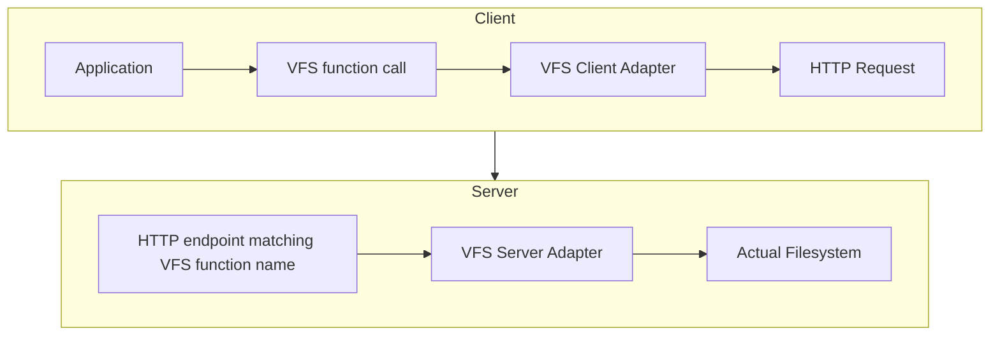

# MeeseOS Server

This is the main node server module for MeeseOS.

Contains all services and interfaces required to run a node server for MeeseOS.

## VFS Chain

<!-- https://mermaid-js.github.io/mermaid/#/flowchart -->

The client always represents stuff with virtual paths, wihch the VFS server adapter is able to resolve to access a physical filesystem.

The APIs are not limited to the MeeseOS server. A VFS client adapter can theoretically connect to anything as long as the file objects have the correct shape.
